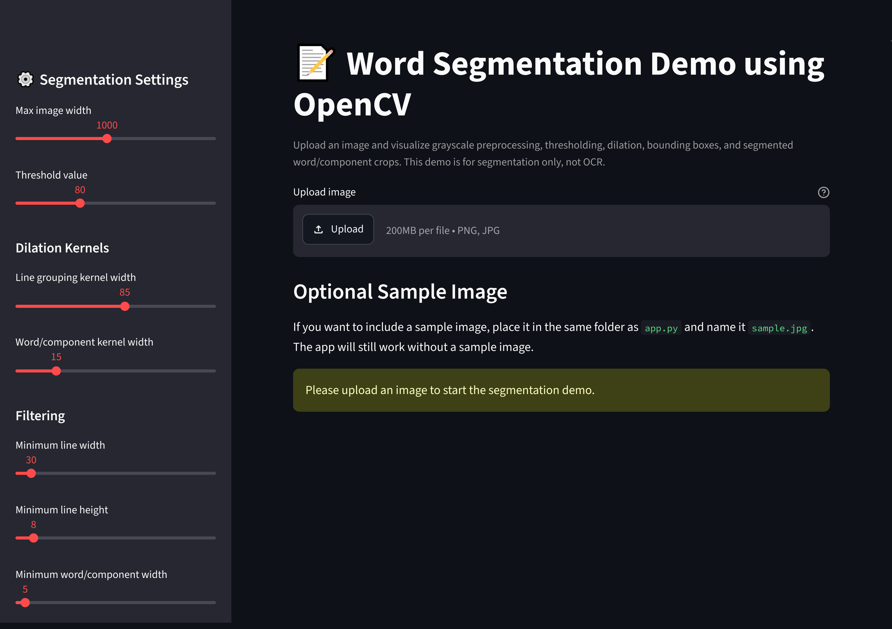
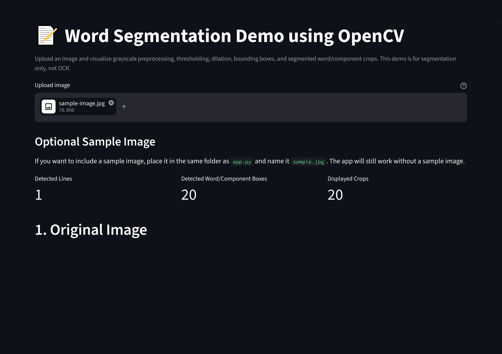
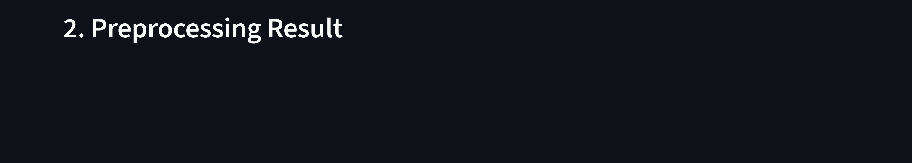
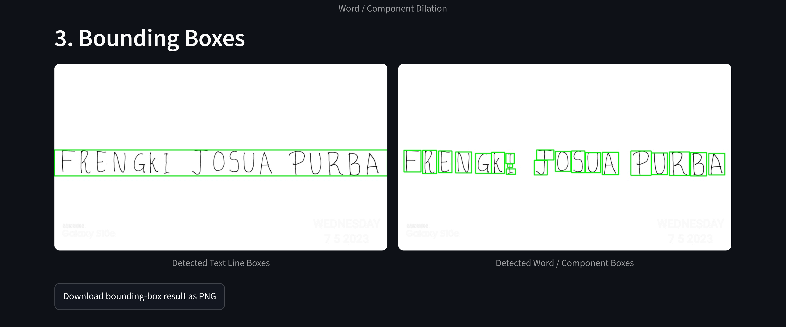
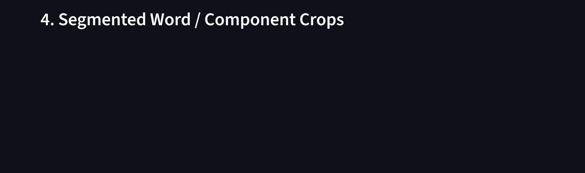

# Word Segmentation using OpenCV

A computer vision portfolio project that demonstrates an OpenCV-based image preprocessing pipeline for detecting handwritten text regions and extracting segmented word/component crops from an input image.

> **Note:** This project is not an OCR system. It does not recognize or convert handwriting into digital text. The focus is image preprocessing, contour detection, bounding-box visualization, and word/component segmentation.

## Live Demo

- **Streamlit App:** [https://word-segmentation-opencv-vwxn5bwzguagidn8qdsqcq.streamlit.app/](https://word-segmentation-opencv-vwxn5bwzguagidn8qdsqcq.streamlit.app/)
- **GitHub Repository:** [https://github.com/frnqpur/word-segmentation-opencv](https://github.com/frnqpur/word-segmentation-opencv)

## Project Overview

This project applies a classical computer vision workflow to process handwritten text images. The application allows users to upload an image, view preprocessing stages, inspect bounding-box results, and review segmented word/component crop outputs through an interactive Streamlit interface.

## Features

- Upload handwritten text image.
- Display original/resized image.
- Show grayscale preprocessing result.
- Show binary inverse threshold result.
- Apply morphological dilation for text grouping.
- Detect contours using OpenCV.
- Draw bounding boxes around detected text regions and components.
- Extract segmented word/component crops.
- Display results in a Streamlit web demo.
- Provide graceful error handling for invalid image input.

## Tech Stack

| Technology | Purpose |
|---|---|
| Python | Core programming language |
| OpenCV | Image preprocessing, dilation, contour detection, and bounding boxes |
| NumPy | Image array manipulation |
| Pillow | Image upload and image conversion handling |
| Streamlit | Interactive web demo |
| Matplotlib | Optional visualization support |

## Image Processing Pipeline

```txt
Input Image
→ RGB Conversion
→ Resize if Needed
→ Grayscale Conversion
→ Binary Inverse Thresholding
→ Morphological Dilation
→ Contour Detection
→ Bounding Box Sorting
→ Segmented Crop Extraction
→ Streamlit Visualization
```

## Demo Screenshots

| Step | Screenshot |
|---|---|
| Upload Screen |  |
| Original Image |  |
| Preprocessing Result |  |
| Bounding Box Output |  |
| Segmented Word Crops |  |

## Repository Structure

```txt
word-segmentation-opencv/
├── app.py
├── requirements.txt
├── README.md
├── README_DEPLOY.md
├── assets/
│   └── sample-image.jpg
├── screenshots/
│   ├── 01-upload-screen.png
│   ├── 02-original-image-1.png
│   ├── 03-threshold-preprocessing-result-1.png
│   ├── 04-bounding-box-output.png
│   └── 05-segmented-words-output-1.png
└── portfolio-kit/
    ├── PROJECT_BRIEF.md
    ├── RECRUITER_VIEW.md
    ├── LOCAL_SETUP.md
    ├── STREAMLIT_DEPLOYMENT.md
    ├── SCREENSHOT_CHECKLIST.md
    ├── CASE_STUDY_ID.md
    ├── CASE_STUDY_EN.md
    ├── CV_BULLETS.md
    ├── GITHUB_README.md
    └── SECURITY_CLEANUP.md
```

## Local Setup

### 1. Clone Repository

```bash
git clone https://github.com/frnqpur/word-segmentation-opencv.git
cd word-segmentation-opencv
```

### 2. Create Virtual Environment

```bash
python -m venv .venv
```

### 3. Activate Virtual Environment

Windows PowerShell:

```powershell
.\.venv\Scripts\Activate.ps1
```

Windows CMD:

```cmd
.venv\Scripts\activate
```

macOS/Linux:

```bash
source .venv/bin/activate
```

### 4. Install Dependencies

```bash
pip install -r requirements.txt
```

### 5. Run Streamlit App

```bash
streamlit run app.py
```

Then open the local URL shown in the terminal, usually:

```txt
http://localhost:8501
```

## requirements.txt

```txt
opencv-python-headless>=4.8,<5
numpy>=1.24,<3
pillow>=10,<12
streamlit>=1.30,<2
matplotlib>=3.7,<4
```

## Recommended Sample Image

Use a clean handwritten image with:

- Clear contrast between text and background.
- Bright and simple background.
- No private or sensitive information.
- No GPS/EXIF metadata.
- No faces, addresses, phone numbers, signatures, or official documents.

## Limitations

- This project does not perform OCR.
- It does not recognize characters or words.
- It does not use machine learning or deep learning.
- Results depend on lighting, contrast, threshold value, and dilation kernel size.
- It is designed for portfolio and educational demonstration purposes.

## Portfolio Value

This project demonstrates practical skills in computer vision, OpenCV image preprocessing, thresholding, morphological dilation, contour detection, bounding-box visualization, segmented crop extraction, and simple interactive application deployment using Streamlit.
